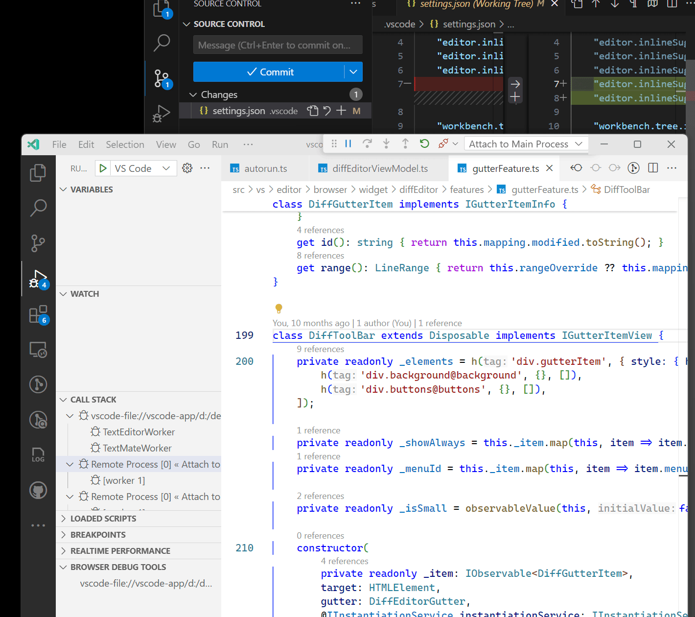

# Browser Dev Tools

[Based on Edge DevTools](https://github.com/microsoft/vscode-edge-devtools).

## Features

* Open Edge DevTools for any webpage/electron window that is currently debugged
    * To open, go to the "Browser Debug Tools" view in the "Run And Debug" sidebar
* Reveal element in DevTools when cursor is at a CSS selector (configurable)

